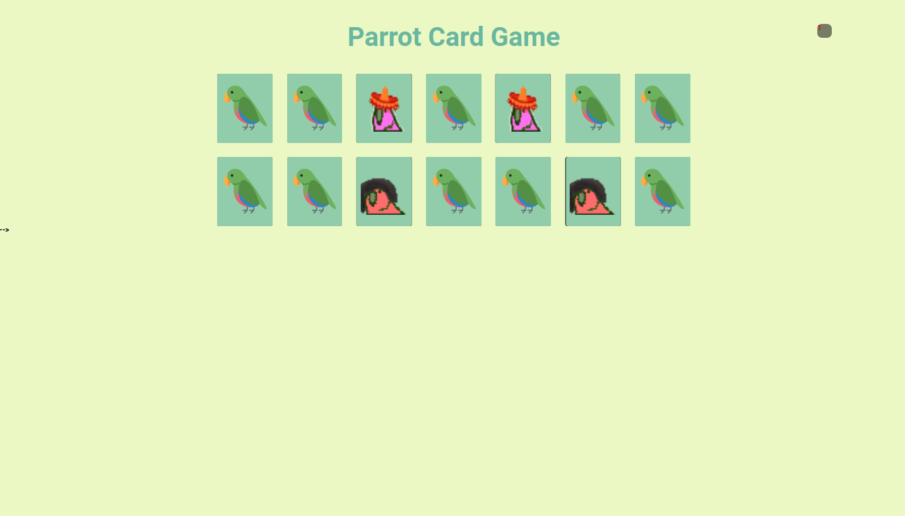

# Parrot-Card-Game
Jogo da memoria, aprendendo a manipular o DOM, javascript, css e HTML

Segundo projeto com JavaScript, implementação do jogo Parrot Card Game, um jogo da memória temático com aleatoriedade, efeitos e transição, responsividade e papagaios dançantes! Esse game apesar de simples em seu layout, continha uma boa dose de lógica 😥 (para alguém que estava aprendendo fazia só 4 semanas). Foi bem desafiador fazer, mas também recompensador!

### Como rodar o projeto na sua máquina
- Clone esse repositório 
